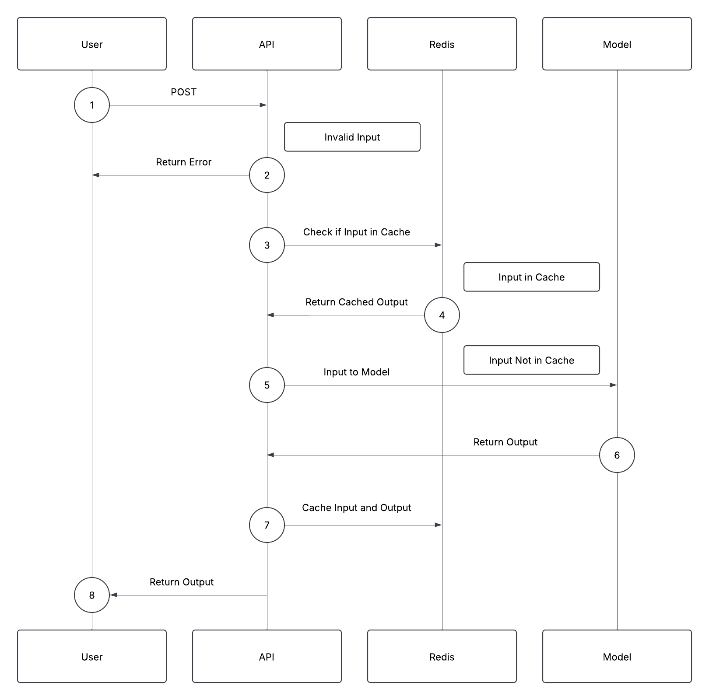
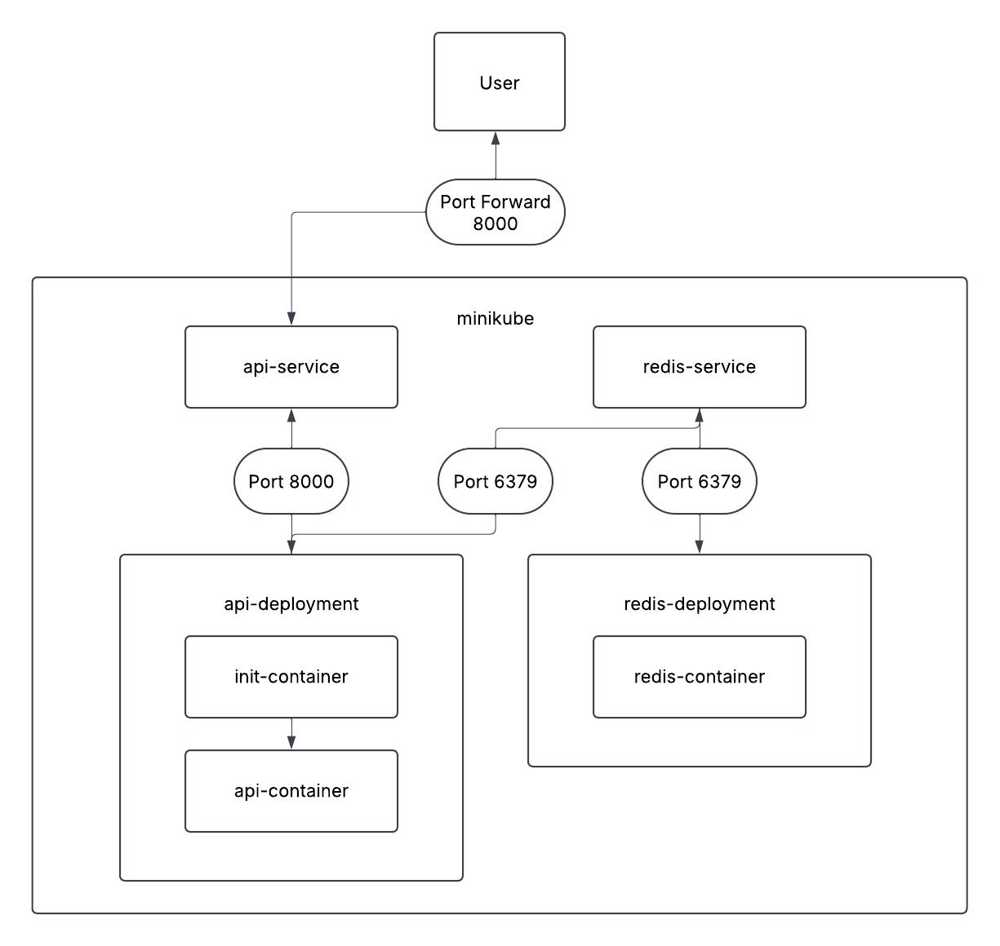

# California Housing API

A FastAPI-based house price prediction API with Redis, Docker, and Kubernetes for efficient, scalable deployment.

## Introduction

This API provides price predictions based on house features using a model trained on the California Housing dataset from scikit-learn. Optimized for efficiency and production readiness, it leverages Redis caching for faster responses and supports containerized deployment with Docker and Kubernetes.

- **FastAPI**: High-performance, asynchronous REST API framework.
- **Docker**: Ensures a consistent and portable runtime environment.
- **Redis**: Caches frequently accessed data to improve response times.
- **Kubernetes**: Manages containerized applications for scalability, availability, and automated deployments.

## Table of Contents

- [Directory](#directory)
- [Setup](#setup)
- [Data](#data)
- [Model](#model)
- [API](#api)
- [API Diagram](#api-diagram)
- [Endpoints](#endpoints)
- [FastAPI](#fastapi)
- [Redis](#redis)
- [Docker](#docker)
- [Kubernetes](#kubernetes)
- [Kubernetes Diagram](#deployment-diagram)

## Directory

- `/manifest`: Folder containing Kubernetes manifest files for deploying the API
- `/src`: Folder containing the main FastAPI application code, including Pydantic models for input and output validation
- `/tests`: Folder containing pytest test cases to verify API functionality
- `Dockerfile`: Defines the containerization process using a multi-stage build for efficiency
- `model.pkl`: Serialized machine learning model trained on the California Housing dataset, loaded by the API for predictions
- `poetry.lock`: Dependency lock file generated by Poetry to ensure reproducible environments
- `pyproject.toml`: Configuration file for Poetry, specifying dependencies and project metadata
- `train.py`: Script that trains an SVR model using grid search, preprocesses data, and saves the best model as `model.pkl`

## Setup

I built my application using Poetry, a modern dependency management and packaging tool for Python. Poetry simplifies environment setup by automatically creating a virtual environment and ensuring consistent dependency management across different systems.  I separate my dependencies into two categories:  

### **Production Dependencies**  
- **`fastapi` (`^0.112.2` with the `standard` extra)**: Provides a high-performance web framework for building APIs.  
- **`joblib` (`1.4.2`)**: Handles efficient model serialization and parallel computation.  
- **`fastapi-cache2` (`0.1.9` with the `redis` extra)**: Implements caching functionality to improve API response times using Redis.  
- **`scikit-learn` (`1.5.2`)**: Provides essential machine learning tools, including model training, evaluation, and preprocessing utilities.  

### **Development Dependencies**
- **`pytest` (`^8.3.2`)**: Used for writing and running test cases to ensure API reliability.  
- **`ruff` (`^0.6.2`)**: A fast linter and formatter to enforce code quality and maintainability.  

## Data

This project uses the [California Housing](https://scikit-learn.org/stable/datasets/real_world.html#california-housing-dataset) dataset from scikit-learn. The dataset contains 20,640 samples with 9 columns, including 8 features and 1 target.

### Features:

- **MedInc**: Median income in block group  
- **HouseAge**: Median house age in block group  
- **AveRooms**: Average number of rooms per household  
- **AveBedrms**: Average number of bedrooms per household  
- **Population**: Block group population  
- **AveOccup**: Average number of household members  
- **Latitude**: Block group latitude  
- **Longitude**: Block group longitude  

### Target:

The target is the median house value for California districts, expressed in hundreds of thousands of dollars. This dataset was derived from the 1990 U.S. Census, with each row representing a census block group.

## Model

The model is built in `train.py` using a Support Vector Regressor (SVR), optimized through grid search with cross-validation. The training pipeline includes data imputation for handling missing values, scaling to normalize feature distributions, and hyperparameter tuning to enhance performance  The final model is serialized and saved as `model.pkl` which is loaded by the API.

## API
I can run my API and access it on localhost:8000 using Uvicorn, Docker, or Minikube. 

### Running with Uvicorn

1. **Start Redis**
   ```sh
   redis-server
   ```
2. **Start Application**
   ```sh
   poetry run uvicorn src.main:api
   ```

### Running with Docker
1. **Start Redis**
   ```sh
   redis-server
   ```
2. **Build Image**  
   ```sh
   docker build -t api .
   ```
3. **Run Container**  
   ```sh
   docker run -p 8000:8000 api
   ```

### Running with Minikube
1. **Start Minikube**  
   ```sh
   minikube start
   ```
2. **Switch to Minikube Docker Daemon**  
   ```sh
   eval $(minikube docker-env)
   ```
3. **Build Image**  
   ```sh
   docker build -t api .
   ```
4. **Apply Kubernetes Manifests**  
   ```sh
   kubectl apply -f manifests
   ```
5. **Port Forward**  
   ```sh
   kubectl port-forward service/api-service 8000:8000
   ```

## API Diagram



## Endpoints
- `/health`:

**Example Request**
```sh
curl http://localhost:8000/health
```
**Example Return**
```sh
{"Status":"Healthy"}
```

- `/single-predict`:

**Example Request**
```sh
curl -X 'POST' 'http://localhost:8000/single-predict' -H 'accept: application/json' -H 'Content-Type: application/json' -d '{"MedInc": 8.3252, "HouseAge": 42, "AveRooms": 6.98, "AveBedrms": 1.02, "Population": 322, "AveOccup": 2.55, "Latitude": 37.88, "Longitude": -122.23}'
```
**Example Return**
```sh
{"prediction":4.423536981962716}
```

- `/multiple-predict`:

**Example Request**
```sh
curl -X 'POST' "http://localhost:8000/multiple-predict" -L -H 'Content-Type: application/json' -d '{"houses": [{ "MedInc": 8.3252, "HouseAge": 42, "AveRooms": 6.98, "AveBedrms": 1.02, "Population": 322, "AveOccup": 2.55, "Latitude": 37.88, "Longitude": -122.23 }, {"MedInc": 8, "HouseAge": 42, "AveRooms": 7, "AveBedrms": 1, "Population": 300, "AveOccup": 3, "Latitude": 38, "Longitude": -122 }]}'
```
**Example Return**
```sh
{"predictions":[4.423536981962716,3.9984649069157188]}
```

## FastAPI

FastAPI serves as the foundation for my API, providing a high-performance, asynchronous REST framework. The API initializes using a `lifespan_mechanism` function. At startup, it logs an starting message, loads a pre-trained model, and connects to Redis. At shutdown, it logs an ending message.

My API includes three endpoints:

- `/health` checks if the API is running by returning a simple status message.
- `/single-predict` accepts a single house input, vectorizes it, and returns a prediction.  
- `/multiple-predict` processes multiple house inputs at once, vectorizes them, and returns batch predictions.  

I use Pydantic models to enforce constraints on input data and provide automatic type checking, ensuring that only well-formed requests reach the model. `Pydantic_Single_Input` and `Pydantic_Multiple_Inputs` define the expected data format for prediction requests, making the API more robust against incorrect inputs. Predictions are vectorized using `.vectorize()` before being passed to the model, maintaining consistency in input shape. Batch processing is optimized by running all predictions in a single inference call instead of looping through individual inputs, which improves performance and reduces overhead. To ensure reliability, I test my API functionality with Pytest, validating both expected behavior and edge cases by running:

```sh
poetry run pytest
```

## Redis

Redis-based caching is implemented using `FastAPICache`, reducing redundant computations by storing recent predictions for 60 seconds.  When running with Uvicorn or Docker, I launch Redis locally on port 6379 using the command:

```sh
redis-server
```

For Minikube deployments, Redis is configured with one replica. To keep the cache organized and prevent key collisions, all keys are prefixed with `"api-cache"`. 
I can inspect stored keys using the command:  

```sh
redis-cli KEYS '*'
```

This setup ensures efficient caching, minimizing latency while maintaining a structured and easily manageable Redis store.

## Docker

I use Docker to containerize my FastAPI application, ensuring consistency across environments and simplifying deployment. By packaging the application with its dependencies, Docker eliminates configuration issues and makes scaling easier. Multi-stage builds keep the final image lightweight by separating dependency installation from execution, improving efficiency and security.

My Dockerfile follows a multi-stage build process. The builder stage installs system dependencies, sets up a virtual environment in `/app/venv`, and installs production dependencies using Poetry. The runner stage starts from a clean `python:3.12-slim` image, copies over the virtual environment, application code, and model file, and modifies the `PATH` to activate the virtual environment.

The container runs the FastAPI application with Uvicorn, exposing it on port `8000` at `http://localhost:8000`. This setup ensures portability and reliability, making the transition to orchestration tools like Kubernetes seamless.

## Kubernetes

I use Kubernetes with Minikube to deploy my FastAPI application locally, ensuring a scalable and resilient setup. To build my Docker images within Minikube, I configure my Docker daemon accordingly. 

My Kubernetes deployment is organized within a dedicated namespace, `bryguan`, defined in `namespace.yaml`. The API and Redis components are deployed separately for better maintainability and scalability. `redis-deployment.yaml` sets up Redis as a single replica instance, while `api-deployment.yaml` deploys the API with three replicas to ensure high availability. The API deployment includes an `initContainer` that waits for Redis to be ready before starting the main container. It also defines a readiness probe, liveness probe, and startup probe to monitor API health.

For networking, `redis-service.yaml` exposes Redis internally within the cluster, while `api-service.yaml` sets up a LoadBalancer service to distribute traffic across API replicas. To test the deployment locally, I use port forwarding to access `api-service` from my machine.

## Kubernetes Diagram

